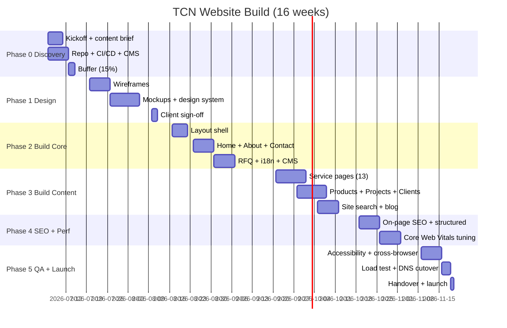

# 03 — Development Plan: PT. Telaga Cahaya Nusantara (TCN) Corporate Website

## 1. Document Control

| Field | Value |
|---|---|
| Document ID | TCN-WEB-DEV-PLAN-v1.0 |
| Version | 1.0 (Draft) |
| Author | General (project team) |
| Status | Draft — pending client kickoff approval |
| Last updated | 2026-06-19 |
| Source of truth | `business-context.md` (TCN); `01-prd.md` (PRD); `02-system-design.md` (System Design) |
| Companion docs | 01-prd.md, 02-system-design.md, 04-seo-strategy.md |

---

## 2. Executive Summary

The TCN corporate website is sequenced as a **16-week, 6-phase build** delivered by a 7-person cross-functional team using 2-week Agile sprints with weekly client demos. Work begins with a 2-week discovery sprint to gather content, stand up the Next.js 14 + Sanity CMS stack on Vercel, and lock the design system kickoff; then moves through design (W3–5), core build (W6–9), content-heavy build (W10–12), SEO & performance hardening (W13–14), and a QA/launch/handover phase (W15–16). Key milestones are: Figma sign-off (W5), CMS integration live (W9), catalog and 13 service detail pages in (W12), Lighthouse ≥ 90 on production build (W14), and public launch on `tcn-corp.com` with bilingual id-ID/en routing (W16). A 15% time buffer per phase plus a 30-day post-launch hypercare period absorb the highest-probability risks (client content delays, design feedback loops, and CMS learning curve). Total engineering effort is sized at **~2,360 hours** (recommended team) or **~1,470 hours** (lean team); hosting/3rd-party costs are excluded — see `02-system-design.md` §14.

---

## 3. Team & Roles

### Recommended Team (7 people, ~6.0 FTE aggregate)

| Role | Responsibility | FTE % | Key Deliverables |
|---|---|---|---|
| **Project Manager / Product Owner** (client side: Ardiansyah or TBD Director) | Owns scope, runs weekly demos, signs off each phase, brokers client feedback | 50% | Phase exit sign-offs, change-request log, stakeholder comms |
| **Tech Lead / Full-stack Developer (Next.js)** | Architecture, CMS schema, i18n routing, RFQ backend, CI/CD, code review | 100% | Repo, CI/CD pipeline, CMS schema, core pages, deploy |
| **UI/UX Designer** | Wireframes, mockups, design system (Figma), handoff | 100% W3–9; 25% W10–16 | Signed-off Figma file, design tokens, component library |
| **Frontend Developer** | Implements pages from Figma, animations, accessibility | 100% W6–14 | Pixel-accurate page implementations |
| **Content Lead** (client side) | Writes id-ID copy, supplies images, project case studies, client logo permissions | 50% | All final copy + media by W11 |
| **SEO Specialist** (part-time) | Keyword research, on-page briefs, structured data, Search Console | 25% W1–14; 10% W15+ | On-page SEO across all pages, sitemap submission, monthly reports |
| **QA / Tester** | Manual + automated test execution, accessibility audit, bug triage | 50% W6–16 | Test plans, bug reports, pre-launch sign-off |

### Lean Team (budget-constrained; ~3.4 FTE aggregate)

If budget forces compression, drop the dedicated Frontend Developer and the SEO Specialist's hours, fold QA into the Tech Lead, and lean on the client Content Lead:

- 1 Tech Lead / Full-stack Developer (Next.js) — 100% — does design implementation, QA, deploy
- 1 UI/UX Designer (contract, W3–8 only) — 50% during design, then ad-hoc
- 1 Content Lead (client side) — 75% — writes copy, supplies assets, runs their own QA
- 1 PM (client side) — 25% — owns sign-off
- 1 part-time SEO consultant — 10% across the full timeline

The lean shape extends the timeline by ~3 weeks (19 weeks total) and trades polish for cost; not recommended if Vale/Freeport-class logos will appear on the homepage.

---

## 4. Methodology

We use **2-week Agile sprints with a phased waterfall gate** at each phase exit — stable weekly cadence for the client, hard exit criteria prevent scope drift.

**Sprint cadence (8 sprints, S0–S7):** Sprint planning Monday W1 (1h, async). Daily standup 15min, async written. Weekly demo every Friday 45min, recorded (Ardiansyah + PM attend). Sprint review + retro at sprint end (1h) feeds the next plan.

**Definition of Done** — a task is done only when **all** are true: (1) code merged to `main`, CI green (lint, type-check, unit, Playwright smoke); (2) feature on a Vercel preview URL; (3) Lighthouse mobile ≥ 90 on P/A/BP/SEO where applicable; (4) CMS entry workflow documented or page fully static; (5) peer reviewed (Tech Lead for code, Designer for UI); (6) demoed Friday or waived by PM.

**Change-request process:** Client requests outside PRD go into a **Change Request (CR)** log in Notion. Each CR is T-shirt sized (S/M/L), time impact estimated, PM-approved. Buffer absorbs up to **3 S/M CRs per phase** without slip; L CRs require phase extension or cut.

---

## 5. Phases & Milestones

### Phase 0 — Discovery & Setup (Week 1–2, Sprint S0)

| Item | Detail |
|---|---|
| Owner | PM + Tech Lead |
| Key tasks | Kickoff workshop; client content collection brief; brand/logo intake; repo scaffold; CI/CD; Sanity (or Strapi) provisioning; Vercel project; design system kickoff; analytics + monitoring accounts |
| Exit criterion | Repo builds and deploys a "Hello World" Next.js 14 (App Router, id-ID + en) to a preview URL; Sanity Studio reachable; Figma workspace created with token library started; Content Brief signed off by client |
| Demo artifact | Live preview URL + Sanity Studio login |

### Phase 1 — Design (Week 3–5, Sprints S1–S2)

| Item | Detail |
|---|---|
| Owner | Designer + PM |
| Key tasks | Wireframes (low-fi) → mockups (hi-fi) for all PRD pages; design system (colors, typography, spacing, components); Figma component library; client logo wall layout; mobile + desktop breakpoints; a11y color-contrast pass |
| Exit criterion | Client signs off on Figma — all pages, both languages, both breakpoints, design system complete. Two rounds of feedback max per page |
| Demo artifact | Figma file + click-through prototype |

### Phase 2 — Build — Core (Week 6–9, Sprints S2–S3)

| Item | Detail |
|---|---|
| Owner | Tech Lead + Frontend Developer |
| Key tasks | Layout shell (header, footer, nav, language switcher, WhatsApp floating button); Home; About; Contact; RFQ form (with backend, captcha, WhatsApp + email notification); i18n routing wired (`/[locale]/...`); Sanity integration for first 3 content types (page, service, siteSettings); sitemap.xml + robots.txt stubs |
| Exit criterion | All 5 core pages live on preview URL in both languages, CMS-driven where appropriate, RFQ form end-to-end tested (submits → email + WhatsApp received) |
| Demo artifact | Preview URL walkthrough + Loom of RFQ submission |

### Phase 3 — Build — Content (Week 10–12, Sprints S4–S5)

| Item | Detail |
|---|---|
| Owner | Frontend Developer + Content Lead (client) |
| Key tasks | Service overview page + 13 service detail pages; Products catalog page with PDF download; Projects index + project detail template; Clients page (logo wall + testimonials); Site search (Pagefind); blog/insights index + post template; client enters content into Sanity Studio |
| Exit criterion | All content pages live with real client content; Site search indexes every page; blog post template proven with at least 3 sample posts |
| Demo artifact | Preview URL walkthrough of full sitemap |

### Phase 4 — SEO & Performance (Week 13–14, Sprint S6)

| Item | Detail |
|---|---|
| Owner | SEO Specialist + Tech Lead |
| Key tasks | Per-page meta (titles, descriptions, OG, Twitter Card); structured data (Organization, LocalBusiness × 2 offices, BreadcrumbList, Product, FAQPage); hreflang tags; canonical URLs; sitemap.xml finalized + image sitemap; robots.txt; Google Search Console + Bing Webmaster setup; Pagefind tuning; Core Web Vitals tuning (image lazy-load, font subset, JS bundle audit); Lighthouse mobile ≥ 90 across all KPIs |
| Exit criterion | Lighthouse mobile ≥ 90 P/A/BP/SEO on every key template; Search Console verified; sitemap submitted; structured data passes Rich Results test |
| Demo artifact | Lighthouse report + Search Console screenshot |

### Phase 5 — QA, Launch & Handover (Week 15–16, Sprint S7)

| Item | Detail |
|---|---|
| Owner | QA + Tech Lead + PM |
| Key tasks | Accessibility audit (axe + manual screen-reader); cross-browser testing (Chrome, Safari, Firefox, Samsung Internet, Edge — last 2 versions); mobile device matrix (iPhone SE, mid-range Android, iPad); load test (k6, 100 concurrent); 404/500/410 pages; DNS cutover to `tcn-corp.com`; SSL cert provisioning; CSP + HSTS headers; monitoring live (Sentry, UptimeRobot, Plausible); CMS training session for client; documentation handover (admin guide, content workflow) |
| Exit criterion | Zero P0/P1 bugs; cross-browser pass; a11y WCAG 2.1 AA pass; DNS live; monitoring dashboards accessible to client; admin guide acknowledged by client |
| Demo artifact | Production URL live; QA report; handover doc |

### Gantt Timeline (Mermaid)



---

## 6. Detailed Task Breakdown

50 specific tasks across setup, design, frontend, backend, content, SEO, QA, launch, and post-launch. Status is the planned status at plan adoption.

| ID | Title | Phase | Owner | Depends on | Hrs | Wk | Status |
|---|---|---|---|---|---|---|---|
| T-001 | Kickoff workshop with Ardiansyah + Director | P0 | PM | — | 4 | 1 | Pending |
| T-002 | Content brief sent to client (copy, photos, logos) | P0 | PM | T-001 | 3 | 1 | Pending |
| T-003 | Brand assets intake (logo, palette, fonts) | P0 | Designer | T-001 | 4 | 1 | Pending |
| T-004 | Repo scaffold: Next.js 14 App Router + TS + Tailwind + shadcn/ui | P0 | Tech Lead | — | 6 | 1 | Pending |
| T-005 | CI/CD pipeline (GitHub Actions: lint, type-check, test, preview deploy) | P0 | Tech Lead | T-004 | 6 | 1 | Pending |
| T-006 | Sanity CMS project + Studio deploy | P0 | Tech Lead | — | 6 | 1 | Pending |
| T-007 | Vercel project + env vars + branch previews | P0 | Tech Lead | T-004 | 3 | 1 | Pending |
| T-008 | i18n routing scaffold `/[locale]/` with id-ID default | P0 | Tech Lead | T-004 | 4 | 2 | Pending |
| T-009 | Plausible + Sentry + UptimeRobot accounts | P0 | Tech Lead | — | 2 | 2 | Pending |
| T-010 | Figma workspace + design token library kickoff | P0 | Designer | T-003 | 4 | 2 | Pending |
| T-011 | Wireframes (low-fi) — all PRD pages, both languages | P1 | Designer | T-010 | 16 | 3 | Pending |
| T-012 | Mockups (hi-fi) — Home, About, Contact, RFQ | P1 | Designer | T-011 | 16 | 4 | Pending |
| T-013 | Mockups — Service overview + 13 service detail | P1 | Designer | T-011 | 24 | 4 | Pending |
| T-014 | Mockups — Products, Projects, Clients, Blog index | P1 | Designer | T-011 | 16 | 4 | Pending |
| T-015 | Design system — colors, type, spacing, components in Figma | P1 | Designer | T-011 | 16 | 5 | Pending |
| T-016 | Client sign-off on Figma (round 1) | P1 | PM | T-012..T-015 | 4 | 5 | Pending |
| T-017 | Layout shell: Header, Footer, Nav, LanguageSwitcher, WhatsAppButton | P2 | Frontend Dev | T-016 | 16 | 6 | Pending |
| T-018 | Home page (hero, value prop, client logo wall, services teaser, CTA) | P2 | Frontend Dev | T-017 | 16 | 6 | Pending |
| T-019 | About page (vision, mission, values, history timeline) | P2 | Frontend Dev | T-017 | 10 | 7 | Pending |
| T-020 | Contact page (both offices map, form, email, phone) | P2 | Frontend Dev | T-017 | 12 | 7 | Pending |
| T-021 | RFQ form UI (multi-step, validation, file upload optional) | P2 | Frontend Dev | T-017 | 16 | 7 | Pending |
| T-022 | RFQ backend (Sanity write OR API route → email + WhatsApp webhook) | P2 | Tech Lead | T-021 | 12 | 8 | Pending |
| T-023 | hCaptcha + rate limit on RFQ | P2 | Tech Lead | T-022 | 4 | 8 | Pending |
| T-024 | Sanity schema: `page`, `service`, `siteSettings`, `rfqSubmission` | P2 | Tech Lead | T-006 | 8 | 8 | Pending |
| T-025 | Sanity Studio customization (branding, role-based access) | P2 | Tech Lead | T-024 | 4 | 9 | Pending |
| T-026 | Service overview page (`/layanan` + `/en/services`) | P3 | Frontend Dev | T-025, T-016 | 8 | 10 | Pending |
| T-027 | Service detail pages × 13 (Construction × 4, Trading × 9) | P3 | Frontend Dev | T-026 | 26 | 10–11 | Pending |
| T-028 | Products catalog page (categorized list, PDF download, filter) | P3 | Frontend Dev | T-025 | 16 | 10 | Pending |
| T-029 | Projects index (filter by industry/vertical) | P3 | Frontend Dev | T-025 | 10 | 11 | Pending |
| T-030 | Project detail template (hero, scope, gallery, results) | P3 | Frontend Dev | T-029 | 12 | 11 | Pending |
| T-031 | Clients page (logo wall, testimonials, vertical grouping) | P3 | Frontend Dev | T-025 | 10 | 11 | Pending |
| T-032 | Site search (Pagefind index build + search UI) | P3 | Frontend Dev | T-027 | 10 | 12 | Pending |
| T-033 | Blog/insights index + post template | P3 | Frontend Dev | T-025 | 12 | 12 | Pending |
| T-034 | Client enters content into Sanity (training + data entry) | P3 | Content Lead | T-025 | 24 | 10–12 | Pending |
| T-035 | Client supplies project case studies (3–6) + photos | P3 | Content Lead | T-002 | 16 | 10–11 | Pending |
| T-036 | Per-page meta titles, descriptions, OG, Twitter Card | P4 | SEO Spec | T-027..T-033 | 16 | 13 | Pending |
| T-037 | Structured data: Organization, LocalBusiness × 2 (Makassar, Jakarta) | P4 | SEO Spec | T-020 | 8 | 13 | Pending |
| T-038 | Structured data: BreadcrumbList, Product (sample), FAQPage | P4 | SEO Spec | T-027, T-028 | 8 | 13 | Pending |
| T-039 | hreflang tags (id-ID ↔ en) + canonical URLs | P4 | Tech Lead | T-008, T-036 | 6 | 13 | Pending |
| T-040 | sitemap.xml + image sitemap + robots.txt | P4 | Tech Lead | T-027..T-033 | 6 | 13 | Pending |
| T-041 | Google Search Console + Bing Webmaster verification | P4 | SEO Spec | T-040 | 4 | 13 | Pending |
| T-042 | Core Web Vitals: image optimization, font subset, JS budget | P4 | Tech Lead | T-027..T-033 | 12 | 14 | Pending |
| T-043 | Lighthouse mobile ≥ 90 on every template | P4 | Tech Lead | T-042 | 8 | 14 | Pending |
| T-044 | Accessibility audit (axe CI + manual screen-reader pass) | P5 | QA | T-027..T-033 | 12 | 15 | Pending |
| T-045 | Cross-browser testing (Chrome/Safari/Firefox/Samsung/Edge — 2 versions) | P5 | QA | T-027..T-033 | 12 | 15 | Pending |
| T-046 | Mobile device matrix (iPhone SE, mid-range Android, iPad) | P5 | QA | T-027..T-033 | 8 | 15 | Pending |
| T-047 | Load test (k6, 100 concurrent RFQ submissions) | P5 | Tech Lead | T-022 | 6 | 16 | Pending |
| T-048 | 404/500/410 + maintenance page templates | P5 | Frontend Dev | — | 6 | 16 | Pending |
| T-049 | DNS cutover to `tcn-corp.com` + SSL cert + HSTS | P5 | Tech Lead | T-043..T-048 | 6 | 16 | Pending |
| T-050 | CMS training session (recorded) + admin guide handover | P5 | PM + Tech Lead | T-025 | 8 | 16 | Pending |
| T-051 | Post-launch hypercare (30 days, daily monitoring) | Post | Tech Lead + QA | Launch | 40 | 17–20 | Pending |
| T-052 | Monthly iteration cadence (analytics review, content updates) | Post | SEO Spec | T-051 | 8/mo | ongoing | Pending |

**Total estimated effort**: ~640 hours of dedicated task work (excluding PM oversight and async review).

---

## 7. Sitemap → Task Coverage Matrix

Slugs follow the PRD's chosen convention: `/id/...` for Bahasa Indonesia (default), `/en/...` for English. Slugs are placeholders pending client sign-off on the final IA.

| Sitemap page (id-ID / en) | Created in task ID | Content owner | QA owner |
|---|---|---|---|
| `/id/beranda` Home (`/en/home`) | T-018 | Content Lead | QA |
| `/id/tentang` About (`/en/about`) | T-019 | Content Lead | QA |
| `/id/layanan` Services overview (`/en/services`) | T-026 | Content Lead | QA |
| `/id/layanan/[slug-construction-1]` Aluminum structure & stainless installation detail | T-027 | Content Lead | QA |
| `/id/layanan/[slug-construction-2]` Building construction & interior detail | T-027 | Content Lead | QA |
| `/id/layanan/[slug-construction-3]` Industrial piping, flanges & valves detail | T-027 | Content Lead | QA |
| `/id/layanan/[slug-construction-4]` Epoxy coating floor detail | T-027 | Content Lead | QA |
| `/id/produk/mekanikal` Mechanical trading detail | T-027 | Content Lead | QA |
| `/id/produk/elektrikal` Electrical trading detail | T-027 | Content Lead | QA |
| `/id/produk/instrumen-kontrol` Instruments & Control detail | T-027 | Content Lead | QA |
| `/id/produk/survei-keselamatan` Survey & Safety detail | T-027 | Content Lead | QA |
| `/id/produk/lighting` Lighting (TCN Lighting) detail | T-027 | Content Lead | QA |
| `/id/produk/flashlight` Flashlights (TCN) detail | T-027 | Content Lead | QA |
| `/id/produk/struktur-aluminium` Aluminum Structure trading detail | T-027 | Content Lead | QA |
| `/id/produk/pre-fabricated-building` Pre-Fab / Guangsha series detail | T-027 | Content Lead | QA |
| `/id/produk/forklift-heli` Forklift Heli detail | T-027 | Content Lead | QA |
| `/id/produk` Products catalog (`/en/products`) | T-028 | Content Lead | QA |
| `/id/proyek` Projects index (`/en/projects`) | T-029 | Content Lead | QA |
| `/id/proyek/[slug]` Project detail (`/en/projects/[slug]`) | T-030 | Content Lead | QA |
| `/id/klien` Clients (`/en/clients`) | T-031 | Content Lead | QA |
| `/id/kontak` Contact (`/en/contact`) | T-020 | Content Lead | QA |
| `/id/rfq` RFQ form (`/en/rfq`) | T-021, T-022 | — (form) | QA |
| `/id/terima-kasih` RFQ thank-you (`/en/thank-you`) | T-021 | Content Lead | QA |
| `/id/pencarian` Site search (`/en/search`) | T-032 | — (algorithmic) | QA |
| `/id/blog` Blog index (`/en/blog`) *(v1.1 — see note)* | T-033 | Content Lead | QA |
| `/id/blog/[slug]` Blog post (`/en/blog/[slug]`) *(v1.1)* | T-033 | Content Lead | QA |
| `/id/404`, `/id/500`, `/maintenance` | T-048 | — | QA |
| `/sitemap.xml`, `/robots.txt`, `/og-image.png`, `/catalog.pdf` | T-040 | SEO Spec | QA |

**Notes on coverage gaps:**

1. **11 vs 13 category discrepancy:** The task prompts reference an "11-category taxonomy" but the source-of-truth `business-context.md` §3 lists 13 distinct service categories (4 Construction + 9 Trading); the PRD's own executive summary says "Construction & Installation (4) vs Trading (11)" which implies 15 total. The Dev Plan follows the source-of-truth and creates 13 service detail pages (T-027 expands to 13 instances). The PRD author and SEO Strategy author should reconcile the count in cycle 2; the matrix above simply expands/contracts with the final PRD sitemap.
2. **Blog scope:** The PRD §11 marks blog/news publishing as **Out of Scope v1 (deferred to v1.1)**. T-033 is therefore scheduled in Phase 3 as a *conditional* deliverable: the template is built (so v1.1 launch is a config flip, not a sprint), but the client is not required to enter blog posts before launch. SEO Strategy's blog content cadence (04-seo-strategy.md §7) begins in Month 2.

---

## 8. Dependencies & Critical Path

### Longest dependency chain (critical path)

```
T-001 Kickoff → T-002 Content brief → T-003 Brand assets → T-010 Figma kickoff
  → T-011 Wireframes → T-012..T-015 Mockups → T-016 Figma sign-off
  → T-017 Layout shell → T-018 Home → T-026 Service overview
  → T-027 Service detail × 13 → T-032 Pagefind search
  → T-040 sitemap → T-043 Lighthouse pass → T-049 DNS cutover → Launch
```

This chain is **15 weeks long** and cannot be parallelized below the phase level. The single most fragile link is **T-002/T-003 client content + brand delivery**, because every downstream design and build task depends on having final assets.

### Key blocking relationships

- **Client content (T-002, T-003, T-034, T-035)** blocks: wireframes (T-011), all mockups (T-012..T-015), every CMS-driven page (T-018..T-033), and SEO (T-036..T-038).
- **Figma sign-off (T-016)** blocks: all of Phase 2 and 3 implementation work.
- **CMS schema (T-024)** blocks: every content-driven page (T-018..T-033) and the CMS training (T-050).
- **i18n routing (T-008)** blocks: every translated page and hreflang (T-039).
- **DNS cutover (T-049)** is the last blocking task before public launch.

Parallelizable work to compress risk: SEO keyword research can run during Phase 1 (drives T-036); Sanity Studio customization (T-025) can run in parallel with layout shell (T-017); client case-study collection (T-035) can run throughout Phase 3.

---

## 9. Content Production Schedule

A "Content Production Calendar" Google Sheet is set up W1 and reviewed every Friday demo. Status per deliverable:

| Deliverable from client | Owner | Due (end of wk) | Used by task |
|---|---|---|---|
| Brand assets (logo SVG/PNG, palette hex, font files) | Ardiansyah / Director | W1 | T-003, T-010 |
| Final id-ID copy: Home hero, About, Services overview | Content Lead | W4 | T-012..T-014 |
| Service detail copy × 13 (id-ID, ~300 words each) | Content Lead | W9 | T-027 |
| English translations of all above | Content Lead (with translator) | W11 | T-027, T-036 |
| Project case studies (3–6 with scope, photos, results, client permission) | Content Lead + Ardiansyah | W11 | T-029, T-030 |
| Client logo wall (14 logos, high-res, with usage permission letter) | Ardiansyah | W8 | T-018, T-031 |
| Office photos (Makassar + Jakarta HQ, exteriors + interiors) | Ardiansyah | W6 | T-020 |
| Product photography (TCN Lighting, Flashlights, Pre-Fab series) | Ardiansyah | W10 | T-028 |
| Legal entity info (NIB, NPWP, Director name) for footer + compliance | Ardiansyah / Director | W8 | T-018, T-031 |
| WhatsApp business number + RFQ notification recipients | Ardiansyah | W6 | T-022 |
| Google Business Profile admin access (Makassar + Jakarta) | Ardiansyah | W12 | SEO Strategy Local SEO |
| Existing Google Search Console access (if any) | Ardiansyah | W13 | T-041 |
| 3 sample blog posts (id-ID, ~1,500 words each) | Content Lead | W12 | T-033 |

---

## 10. Risk Register & Buffers

| # | Risk | Probability | Impact | Mitigation | Buffer applied |
|---|---|---|---|---|---|
| R-1 | Client delays content delivery (copy, photos, logos) past W4 | High | High (delays Phase 1 sign-off and Phase 2 build) | Content brief locked W1; weekly demo accountability; PM escalates to Director at W3 if <50% received | +2 days on Phase 0, +3 days on Phase 1 |
| R-2 | Design feedback loop exceeds 2 rounds per page | Medium | Medium (delays Phase 1 sign-off) | Upfront Figma review workshop with all stakeholders present; written feedback only via single channel | +2 days on Phase 1 |
| R-3 | CMS learning curve slows client content entry (T-034) | High | Medium (delays Phase 3 demo) | CMS training at end of W8 (recorded); reference doc with screenshots; "office hours" 2×/week during W10–W12 | +2 days on Phase 3 |
| R-4 | Lighthouse mobile < 90 due to client-supplied high-res images | Medium | High (SEO milestone missed) | Image processing pipeline (Sanity image API or Cloudinary) with explicit max-dimensions in CMS guidance; QA gates at W13 and W14 | +2 days on Phase 4 |
| R-5 | RFQ form WhatsApp webhook fails or template rejected by Meta | Medium | High (loses lead capture — core KPI) | Fallback to email-only; WhatsApp Cloud API template submitted W10 (4-week approval lead time); UptimeRobot on the webhook | +1 day on Phase 2/5 |
| R-6 | Vale/Freeport/Antam logo usage permission denied retroactively | Low | High (must redesign client logo wall) | Logo permission letters collected W8 (T-035); placeholder alt text ready; design accepts grayscale fallback | +1 day on Phase 3 |
| R-7 | DNS cutover to `tcn-corp.com` disrupts existing email | Low | Critical | Coordinate with client's current DNS admin W13; cutover rehearsal W15; rollback plan documented | +1 day on Phase 5 |
| R-8 | Sanity (or chosen CMS) pricing tier changes after launch | Low | Medium | Lock into annual plan; document self-host migration path to Strapi | None (post-launch) |
| R-9 | Vale / Freeport / Antam legal asks to take down case studies | Low | Medium | Contractual usage rights captured W11; design accepts redaction path | None (post-launch) |

**Time buffer policy**: **15% of each phase duration** is reserved as an unallocated buffer. This is scheduled at the end of each phase in the Gantt chart (rows `p0c`, etc.). Phase buffers are consumed only by approved CRs or realized risks; PM must report buffer burn-down weekly.

**Total contingency**: ~16 days of buffer across the 16-week timeline = **~14% schedule reserve**.

---

## 11. Testing Strategy

| Layer | Tool / Method | Owner | Trigger |
|---|---|---|---|
| **Unit** | Vitest + React Testing Library for components; Node runner for API routes | Frontend Dev | Every PR (CI) |
| **Integration** | Vitest + MSW for API mocks; Sanity test studio | Frontend Dev + Tech Lead | Every PR |
| **E2E** | Playwright — 5 critical flows: home→contact, home→RFQ submit, language switch, search, project detail | QA | Nightly + pre-merge to `main` |
| **Visual regression** | Chromatic (preferred, integrates with Figma) OR Percy | Frontend Dev | Every PR affecting a designed component |
| **Accessibility** | axe-core in Playwright + manual NVDA/VoiceOver pass | QA | W15 audit + CI gate on critical templates |
| **Performance** | Lighthouse CI in GitHub Actions (mobile profile, 4G throttling); WebPageTest spot checks | Tech Lead | Every PR to `main`; W13–W14 hardening |
| **Cross-browser** | BrowserStack or local matrix: Chrome, Safari, Firefox, Samsung Internet, Edge — last 2 versions | QA | W15 manual sweep |
| **Mobile matrix** | iPhone SE (small), Pixel 6 / Galaxy A52 (mid), iPad (tablet); Android 12+ / iOS 16+ | QA | W15 |
| **Load** | k6: 100 concurrent RFQ submissions × 5 min; P95 < 2s | Tech Lead | W16 |
| **Security** | OWASP ZAP baseline; Dependabot weekly; Snyk free tier | Tech Lead | Weekly |
| **Manual QA checklist** | Per-page: meta present, hreflang correct, images alt-tagged, forms validate, contrast checked, language switcher preserves route | QA | W15–W16 |

CI fails the build on: any unit/integration/E2E failure, Lighthouse Performance < 80, axe serious/critical violation, or type/lint error.

---

## 12. Launch Checklist

### Pre-launch (end of W15)

- [ ] DNS `tcn-corp.com` resolves to Vercel; old host (if any) keeps a 301 redirect map
- [ ] SSL certificate provisioned (Let's Encrypt via Vercel); HSTS preload submitted
- [ ] 404, 500, and maintenance pages designed and deployed
- [ ] Plausible analytics live and verified on every page
- [ ] Sentry error tracking live; source maps uploaded
- [ ] UptimeRobot monitoring 5 key URLs (home, contact, RFQ, 404) — 1-min interval
- [ ] Google Search Console verified + sitemap.xml submitted
- [ ] Bing Webmaster Tools verified + sitemap submitted
- [ ] robots.txt allows all except `/admin` and `/api`; references sitemap
- [ ] Cookie banner NOT required (Plausible is cookieless) — confirmed with legal
- [ ] CMS admin access restricted to client IP allowlist (or behind Vercel Password Protection)
- [ ] All secrets in Vercel env vars; no secrets in repo
- [ ] CSP header configured; rate limits on RFQ verified
- [ ] Backup policy: weekly Sanity export to client Google Drive
- [ ] All CRs and known issues resolved or documented

### Launch day (W16 Friday)

- [ ] DNS TTL lowered to 300s 48h before cutover
- [ ] Final smoke test on production URL (home, contact, RFQ submit, language switch)
- [ ] PM announces launch on client WhatsApp group + email
- [ ] Monitoring dashboards open in war room (Slack channel + Plausible live view)
- [ ] First 4 hours: on-call (Tech Lead) watches Sentry + UptimeRobot
- [ ] RFQ form tested end-to-end with a real submission → confirm WhatsApp + email received
- [ ] Google Search Console — request indexing for home page

### Post-launch (30-day hypercare)

- [ ] Daily standup (15 min) for first week; 3×/week for weeks 2–4
- [ ] Sentry + Plausible reviewed daily for errors and traffic anomalies
- [ ] Any P0/P1 bugs fixed within 24h; P2 within 1 week
- [ ] First organic traffic baseline recorded at Day 7 and Day 30
- [ ] Client retrospective at Day 30

---

## 13. Post-Launch Plan

**30-day Hypercare (W17–W20):** Dedicated on-call (Tech Lead + Frontend Dev). Bug SLA: P0 same-day, P1 next-day, P2 ≤ 5 business days. Weekly analytics review with client (traffic, top pages, RFQs, Search Console queries). Confirm all pages indexed by Day 14 in Search Console; re-submit any un-indexed URLs.

**Monthly cadence (Month 2+):** SEO Specialist reviews rankings + organic traffic; PM sends 1-page report. Bi-monthly content sprint (2 new blog posts/month per SEO Strategy §7). Quarterly design + UX review (refresh hero imagery, add projects/testimonials, retire stale content). 6-month milestone: formal review against PRD §10 KPIs; adjust roadmap if ahead/behind. Yearly: full design audit, dependency upgrades (Next.js, Tailwind, Sanity), re-test Core Web Vitals.

**Realistic SEO expectations:** meaningful organic growth takes **3–6 months**. M1–2 the site indexes and builds authority; M3–4 long-tails start ranking; M5–6 head terms crack top 20. Client must commit to the content cadence for this to land.

---

## 14. Budget Estimate

Effort cost only. **Hosting, CMS, domain, 3rd-party SaaS** costs are in `02-system-design.md` §14.

### Recommended Team (7 people, 6.0 FTE aggregate)

| Line item | Hrs | Rate (USD/hr) | Subtotal (USD) |
|---|---|---|---|
| Discovery + PM oversight (16 weeks × 50% × 40h = 320h) | 320 | $60 | $19,200 |
| Tech Lead / Full-stack (16 weeks × 100% × 40h = 640h) | 640 | $90 | $57,600 |
| UI/UX Designer (5 weeks 100% + 8 weeks 25% = 280h) | 280 | $70 | $19,600 |
| Frontend Developer (9 weeks × 100% × 40h = 360h) | 360 | $70 | $25,200 |
| Content Lead client-side (16 weeks × 50% × 40h = 320h) | 320 | $40 (client cost) | $12,800 |
| SEO Specialist part-time (14 weeks × 25% × 40h = 140h) | 140 | $80 | $11,200 |
| QA / Tester (11 weeks × 50% × 40h = 220h) | 220 | $50 | $11,000 |
| **Subtotal engineering effort** | **2,280** | — | **$156,600** |
| Contingency (15%) | — | — | $23,490 |
| **Total recommended (USD)** | — | — | **$180,090** |
| ~IDR equivalent (USD/IDR ≈ 16,200, Jun 2026) | — | — | **~Rp 2.92 milyar** |

### Lean Team (3–4 people)

| Line item | Hrs | Rate (USD/hr) | Subtotal (USD) |
|---|---|---|---|
| PM (client-side, 25% × 19w × 40h) | 190 | $40 | $7,600 |
| Tech Lead / Full-stack (19 weeks × 100% × 40h = 760h) | 760 | $90 | $68,400 |
| UI/UX Designer contract (8 weeks × 50% × 40h = 160h) | 160 | $70 | $11,200 |
| Content Lead client-side (75% × 19w × 40h = 570h) | 570 | $40 | $22,800 |
| SEO consultant (10% × 19w × 40h = 76h) | 76 | $80 | $6,080 |
| **Subtotal** | **1,756** | — | **$116,080** |
| Contingency (15%) | — | — | $17,412 |
| **Total lean (USD)** | — | — | **$133,492** |
| ~IDR equivalent | — | — | **~Rp 2.16 milyar** |

> Rates are illustrative for an Indonesian mid-tier agency; actuals depend on engagement model (T&M vs fixed-bid) and team location. Use these as planning anchors, not contracts.

---

## 15. Open Questions

These must be resolved by the client (Ardiansyah / Director) before kickoff (W1). Each blocks downstream work if unanswered.

1. **Confirm primary Makassar address** — HRS Building (Karunrung 23A, 90113) vs Lili Ruko Cempaka (Boulevard, 90231). Both appear in source materials. *Blocks*: T-020 (Contact page).
2. **Confirm Jakarta postcode** — 12870 (catalog) vs 18270 (profile). The 12870 postcode is correct for Jakarta Selatan Kav. 88 Casablanca. *Blocks*: T-020, T-037 (LocalBusiness structured data).
3. **WhatsApp business number** — for both the floating button and RFQ notification. *Blocks*: T-021, T-022, T-035.
4. **RFQ notification recipients** — who receives the email + WhatsApp alert on a new submission? (e.g. Ardiansyah only, or also Director / Sales team). *Blocks*: T-022.
5. **CMS preference** — Sanity (recommended; managed, fast preview, free tier) vs Strapi (self-hosted, open source, more control). Sanity recommended unless client requires data residency. *Blocks*: T-006, T-024.
6. **Hosting preference** — Vercel (best Next.js DX, CDN reach) vs Indonesian VPS (data residency). *Blocks*: T-007, T-049.
7. **Domain registrar access for `tcn-corp.com`** — who holds it and can update DNS? *Blocks*: T-049.
8. **Client logo permissions** — written permission to display Vale, Freeport, Antam, Hexindo, etc. on the homepage logo wall. *Blocks*: T-018, T-031.
9. **Legal entity details for footer / compliance** — NIB, NPWP, Director name, year established. *Blocks*: T-018, T-031.
10. **Existing Google Search Console / Google Business Profile access** — if any. *Blocks*: T-041, SEO Strategy local SEO.
11. **Are the 13 service categories in business-context.md §3 the final taxonomy?** — The task prompts reference "11-category" but the source lists 13. Confirm before locking the sitemap. *Blocks*: T-027.
12. **Brand colors / typography** — are there existing brand guidelines, or does the designer propose from scratch? *Blocks*: T-010, T-015.
13. **Existing `tcn-corp.com` content** — is there anything on the current site worth preserving (URLs, pages, PDF assets)? *Blocks*: T-040 (sitemap) and T-049 (redirects).
14. **Are there existing brand photos of projects to use?** — if yes, who supplies them; if no, do we hire a photographer. *Blocks*: T-035.
15. **Indonesian VAT / invoice handling** — out of scope for v1 (no e-commerce), but confirm we are not accidentally committing to it. *Blocks*: scope sign-off.
